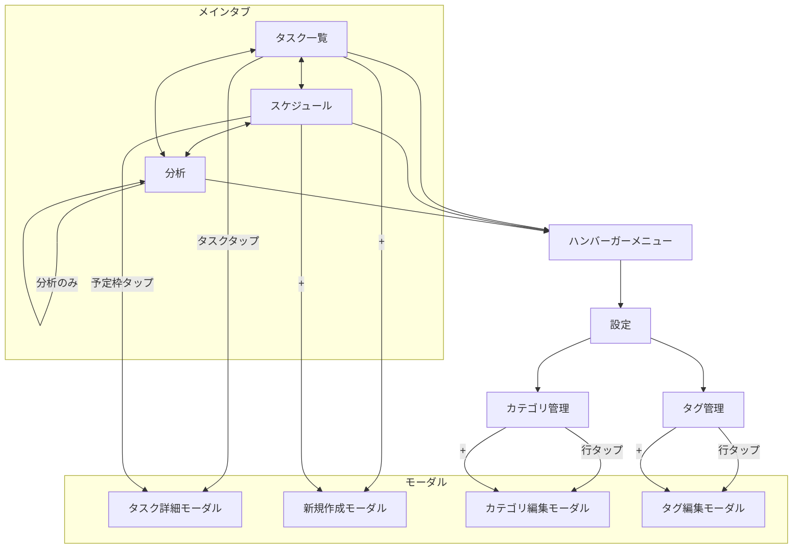

# 画面遷移図: TaskLens（Mermaid）
日付: 2026-03-25

```mermaid
flowchart TB
    %% Tabs
    subgraph Tabs[メインタブ]
        A[タスク一覧]
        B[スケジュール]
        C[分析]
    end

    %% Global Menu
    M[ハンバーガーメニュー]
    S[設定]
    C1[カテゴリ管理]
    T1[タグ管理]

    %% Modals
    subgraph Modals[モーダル]
        D[タスク詳細モーダル]
        N[新規作成モーダル]
        CE[カテゴリ編集モーダル]
        TE[タグ編集モーダル]
    end

    %% Links: Tabs
    A <--> B
    B <--> C
    C <--> A

    %% Menu Access
    A --> M
    B --> M
    C --> M
    M --> S

    %% Settings
    S --> C1
    S --> T1

    %% Task List
    A -->|タスクタップ| D
    A -->|+| N

    %% Schedule
    B -->|予定枠タップ| D
    B -->|+| N

    %% Analysis
    C -->|分析のみ| C

    %% Category/Tag
    C1 -->|行タップ| CE
    C1 -->|+| CE
    T1 -->|行タップ| TE
    T1 -->|+| TE
```
